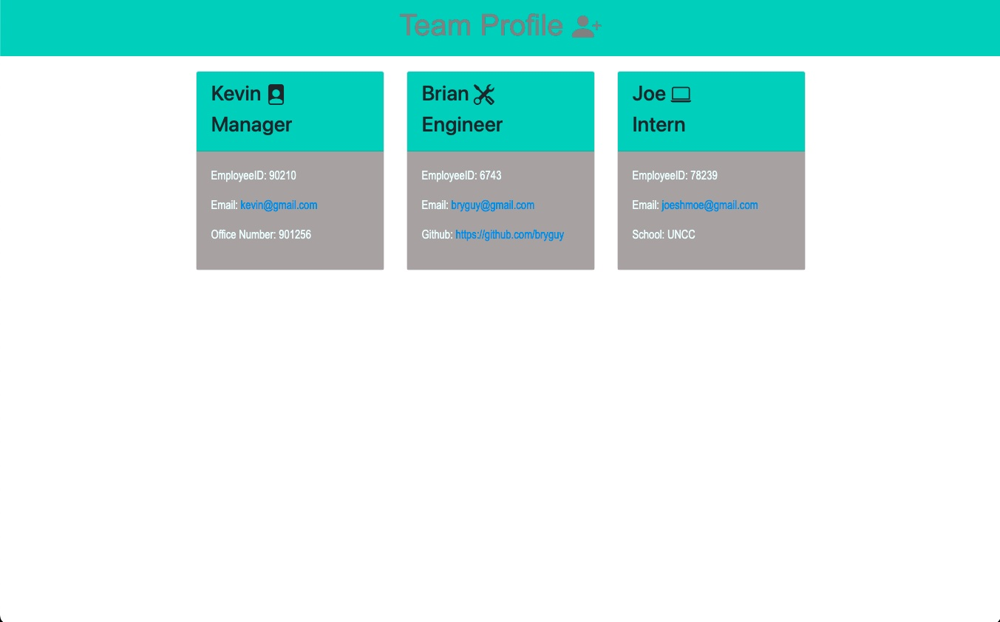

 [] 
# <h1 align="center">Team Profile Generator</h1>

## Video Guide

 
 
Link to Video Guide: https://drive.google.com/file/d/14PUeVDzox-KA-tAFyESwKCbJ1PBVuYCh/view
 
 

## Description
An application that generates a page for team profiles using end-user answers from the command line. 
  
## Table of Contents
  - [Description](#description)
  - [Installation](#installation)
  - [Usage](#usage)
  - [License](#license)
  - [Contributors](#contributors)
  - [Tests](#tests)
  - [Questions](#questions)

## Installation
1. Copy this repository onto your local machine.  
2. Install all packages.  
3. Run `node index`  
4. Answer all prompt questions to generate your team.  
5. To modify, view dist/index.html.

## Usage
Easily create a team page to keep track of team information.  

## License
[]This application is covered under the MIT license. (https://opensource.org/licenses/MIT)

## Contributors
- Bootstrap (https://getbootstrap.com/)
- Node (https://nodejs.org/en)
- Inquirer (https://www.npmjs.com/package/inquirer)
- Jest (https://jestjs.io/)

## Tests
To run tests, run command `npm test`

## Questions? Contact me:
GitHub: https://github.com/ejackson1228/  
Email: ejackson1228@gmail.com
